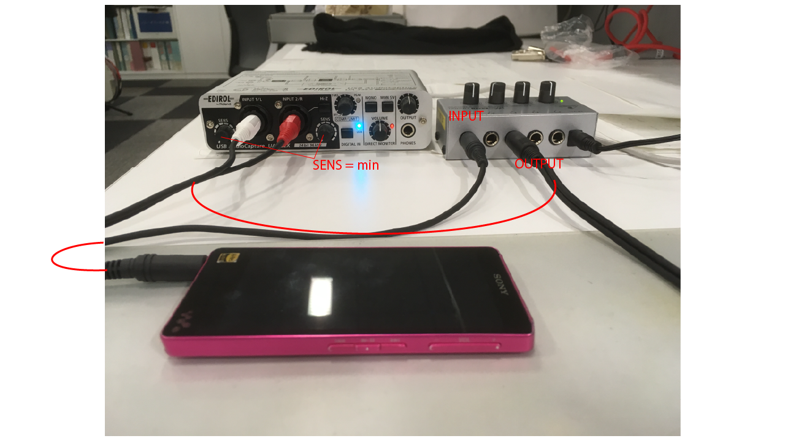

#study__AudioIF

##環境
*	OS X El Capitan(10.11.6)
*	Xcode : 7.2
*	oF : 0.9.0

##add on

##Contents
walkman -> Audio I/F -> PC
でthroughして音楽を鳴らす

  

##Device
*	Audio I/F  
	EDITOL by Roland.  
*	Amp  
	BEHRINGER ヘッドフォンアンプ HA400

##note

